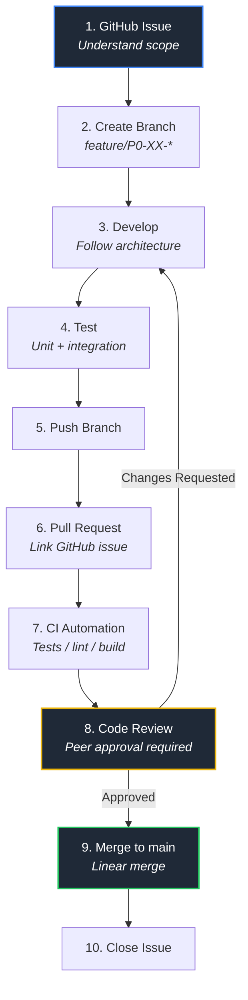

# 🚀 Team Development Workflow & Git Conventions

Welcome to the team! To maintain a clean, readable, and trackable project history on GitHub, everyone must follow this structured development lifecycle and branch naming architecture.

---

## 🗺️ Step-by-Step Development Lifecycle

Below is the required sequence of steps for picking up, developing, and completing any task within the project workspace.



---

## 🌿 Branch Naming Architecture

Branches must strictly match their corresponding task types and ticket IDs using the `type/ID-description` format. Always use lowercase letters and hyphens instead of spaces.

*   ✨ **`feature/P0-XX-description`** — Used when implementing a brand new capability, endpoint, or architecture core block.
*   🐛 **`fix/P0-XX-description`** — Used for debugging active issues, fixing broken schemas, or repairing code logic errors.
*   🧪 **`test/P0-XX-description`** — Reserved strictly for setting up testing suites, mock environments, or automated QA tools.
*   📝 **`docs/P0-XX-description`** — Used when updating technical definitions, user architecture readmes, or inline documentation files.

---

## 🔤 Pull Request Title Conventions

To easily trace back features from our production branch history, all Pull Request titles must begin with their bracketed project target identifier code `[P0-XX]` followed by a concise description.

### 💡 Rule Format
```text
[P0-XX] Short description
```

### 🔍 Production History Examples
*   `[P0-06] Integrate Tree-sitter Python parsing`
*   `[P0-09] Implement relationship resolver`
*   `[P0-16] Implement dependency traversal`
*   `[P0-22] Implement graph visualization`
